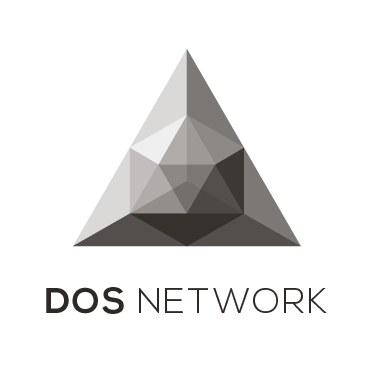

> Decentralized Oracle Service provides blockchains with real world data and computation power.

* :heavy_check_mark: Decentralized network without single point of failure
* :heavy_check_mark: Byzantine fault tolerant open-membership protocol
* :heavy_check_mark: VRF driven near real-time and verifiable result
* :heavy_check_mark: Highly scalable and provably secure with low cost
* :heavy_check_mark: Compatible to heterogeneous blockchains

[Getting Started](contents/blockchains/ethereum?id=quick-start)
