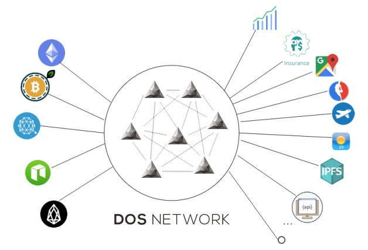

DOS NETWORK is chain-agnostic, meaning that it could serve all existing smart contract platforms; it is decentralized, meaning that it has no single point of failure, no central trust in a single company or special hardware, the trust lives in math and code; it is horizontally scalable, meaning that with more nodes running DOS client software the whole network offers more capability and computation power to supported blockchains; it is designed with cryptoeconomic models, meaning that the protocol is resistant to sybil attacks and the network effect is expanded with provable credibility.

DOS NETWORK is consist of two part: on-chain contracts part and off-chain p2p network part:
* **on-chain contracts part:** A set of DOS system contracts deployed on supported blockchains, mainly including functionalities such as request handling and response/computation result verification, node registration and staking, stats monitoring, payment processing, etc. On-chain system contracts also provide a universal interface to all user contracts across supported chains.

* **off-chain p2p network part:** A client software implementing the core protocol run by third party users aiming for economic rewards, constituting a distributed network. Client software includes several important modules: event monitoring and chain adaptor module, distributed randomness engine module, off-chain group consensus module, and request processing/computation task processing module depending on the type of oracle service the user node provides.
